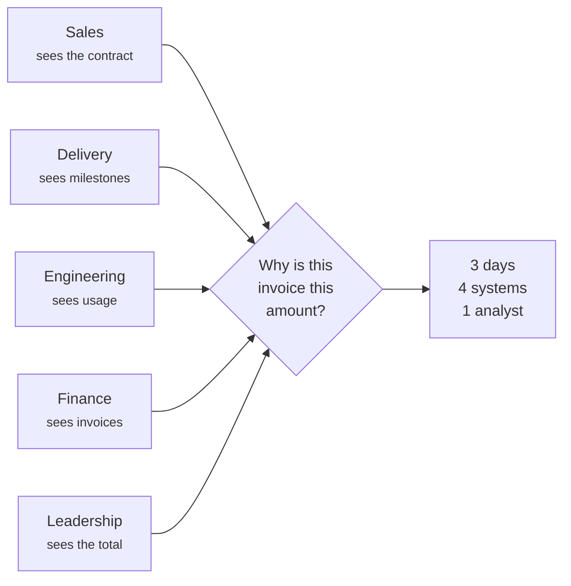
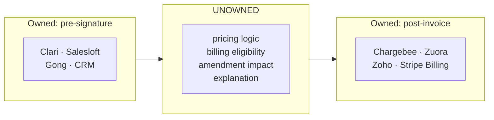
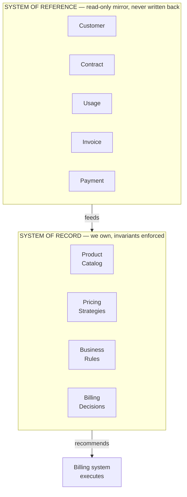
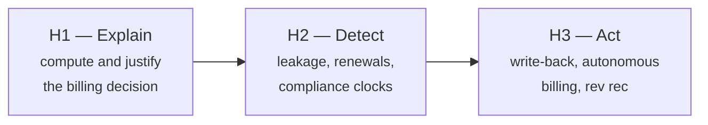

# 01 · Product Vision Document
**Revenue Nexus AI** — Enterprise Revenue Operations Platform
Version 1.0 · 6 August 2026 · **Canonical**

Consolidates and supersedes: `archive/product-charter-v1.md`, `archive/platform-direction-v2.md`

---

## 1. Vision

> **Every rupee of revenue should be explainable in one click, not one week.**

A world where a finance controller, a delivery manager, and a CFO all look at the same number and see the same reasons behind it — because the logic that produced it is written down, versioned, and traceable rather than distributed across four systems and one person's memory.

## 2. Mission

Build the enterprise layer that owns **how revenue is calculated** — the product catalog, the pricing strategies, the business rules, and the resulting billing decision — and connects it to the systems that own everything revenue touches, so that no invoice is ever a mystery and no delivered work is ever silently unbilled.

---

## 3. Problem statement

A B2B SaaS company sells subscriptions, one-time products, usage-based APIs, wallets, and implementation projects — frequently all to the same customer, on the same contract, with customer-specific discounts and amendments layered on top. Every one of those must eventually become an accurate invoice.

The information needed to produce that invoice is distributed:

**The problem in one sentence:**

> Nobody can answer *"why is this invoice this amount?"* without a multi-day investigation across four systems — and because nobody can answer it, nobody notices when the answer is wrong.

That second clause is the expensive half. An unexplainable number is also an unauditable one.

---

## 4. Existing pain points

Grouped by who feels them. Time estimates are the assumptions we intend to validate with design partners, not measured facts.

### Finance

| Pain | Consequence |
|---|---|
| Billing run assembled manually from 4+ sources each month | 3–5 days of senior analyst time per cycle |
| Contract terms re-keyed into billing config by hand | Transcription errors that compound every month until noticed |
| Amendments arrive as email + PDF, applied by memory | The single largest source of billing error |
| No way to explain an invoice to a disputing customer | Disputes take weeks; some are conceded rather than investigated |
| GST e-invoicing 30-day IRN clock tracked in a spreadsheet | Lapsed IRN means the *customer* loses input tax credit |
| TDS deductions treated as short payments | Permanent phantom AR; unclaimed TDS credits are real cash lost |

### Delivery

Milestone completion is recorded in Jira for engineering reasons, with no concept of billing eligibility. A delivery manager marking an epic "Done" has no idea they just triggered — or failed to trigger — a ₹12,00,000 invoice.

### Sales

Discounts and non-standard terms are negotiated in a document and communicated to finance informally. There is no feedback loop telling a rep what their concession actually cost.

### Leadership

The revenue number arrives at month end and cannot be decomposed. "Why is it down 4%?" is a question that takes a week to answer, by which point the month is over.

---

## 5. Why current enterprise systems fail at this

Not because they are bad software. Because of a structural gap.

**The pre-signature half** — revenue orchestration. Gartner created a Magic Quadrant for Revenue Action Orchestration in December 2025; Clari merged with Salesloft the same month at roughly $450M combined ARR. This half owns pipeline, forecast, and seller activity, and stops at the signature.

**The post-invoice half** — subscription billing. Chargebee, Zuora, Maxio, Zoho Billing. Excellent once an invoice exists, because their model *starts* at "here is a subscription."

**Neither owns the middle.** The question of what should be billed — given a contract, a set of amendments, delivery evidence, and metered usage — is answered today by a person.

### Three specific failure modes

**1. ERPs record; they do not reason.** Tally or NetSuite will faithfully store the invoice you tell them to raise. Neither has an opinion about whether it should have been raised.

**2. Billing platforms assume the subscription is already correct.** They are configured, not derived. When the contract and the config disagree, the config wins silently — and the config is what a human typed in.

**3. "Single source of truth" has been tried and did not work.** The Master Data Management category — Informatica, IBM InfoSphere, SAP MDG — spent two decades on exactly this promise. The technology mostly worked; the organisational premise did not. To be authoritative, other systems must write to you or you must write to them, and no system owner in an enterprise concedes either. *(Taught in full: `mentor/M01`.)*

---

## 6. Product positioning

> **Revenue Nexus is the system of record for how revenue is calculated, and the system of reference for everything revenue touches.**

We deliberately do **not** claim to be a single source of truth. We claim authority over the one asset in this domain that no system currently owns: **the pricing and billing logic itself** — today scattered across contract PDFs, a sales quoting spreadsheet, billing config screens, and a senior analyst's memory.

**Positioning statement**

> For **finance controllers at Indian B2B companies** who **assemble billing manually across disconnected systems**, Revenue Nexus is an **enterprise revenue operations platform** that **computes and explains the billing decision from contract, delivery, and usage evidence**. Unlike **billing platforms that must be configured by hand**, Revenue Nexus **derives the answer from the contract and shows its work**.

**Why this is stronger than "single source of truth":** it is achievable, it tells engineering exactly which data we may enforce invariants on, and it means we install with read-only credentials in days rather than requiring a migration.

---

## 7. Customer personas

### Primary — Meera, Finance Controller

**Company:** Indian B2B SaaS, ₹50–500 crore revenue, 200–2,000 employees
**Reports to:** CFO · **Team:** 3–6 analysts

Owns the monthly billing run and the close. Personally accountable when revenue is missed or a compliance deadline lapses. Runs reconciliation in Excel, monthly, manually, and knows it is incomplete — she simply has no better option.

> **Job to be done:** *"Before I close the month, show me what should be billed and prove it — so I can act without re-checking three systems myself."*

The proof requirement is non-negotiable. Meera cannot act on "the system thinks this is right." She needs the contract clause, the delivery record, and the calculation, side by side, with source links. **A recommendation she cannot verify is a recommendation she will not use.**

**Success for her:** billing run drops from 4 days to under 1. Zero disputes she cannot answer on the call.

### Secondary — Arjun, Delivery Manager

Runs implementation projects. Marks milestones in Jira for engineering reasons and does not think of himself as part of the revenue process. Will not adopt a new tool; will answer one confirmation prompt if it arrives where he already works.

> **Job to be done:** *"Tell me when my sign-off has money attached to it, and don't make me learn a new system."*

### Secondary — Priya, CFO

Buys the product; does not use it daily. Wants the aggregate number and the ability to decompose it in a board meeting without a week's notice.

> **Job to be done:** *"Let me answer 'why is revenue down 4%?' in the meeting, not the week after."*

### Influencer — the statutory auditor

An unusual but powerful advocate. The audit lineage — rupee → rule → clause → evidence — is built as much for them as for Meera. An auditor who likes the system is a renewal argument that outlives the champion who bought it.

### Explicitly not personas in v1

Sales reps, customer success, operations, and procurement. Each is a plausible reason to build a feature that dilutes the product.

---

## 8. Business goals

| # | Goal | Measure |
|---|---|---|
| G1 | Make every invoice explainable | 100% of recommended amounts carry a complete rule firing trace |
| G2 | Compress the billing cycle | Billing run: 4 days → under 1 day |
| G3 | Eliminate transcription as an error class | Contract terms drive pricing directly; no manual re-keying |
| G4 | Make amendments safe | Mid-cycle amendment repriced correctly and automatically |
| G5 | Never miss a compliance clock | Zero lapsed IRN filings among monitored invoices |
| G6 | Install in days, not quarters | Read-only credentials → first billing recommendation within 5 working days |

---

## 9. Success metrics

### Product

| Metric | Target | Why this target |
|---|---|---|
| **Calculation accuracy** | 100% | Non-negotiable. A wrong amount is not a bug, it is a lost customer. Rating is a pure function precisely so this is testable. |
| **Explanation completeness** | 100% of amounts traceable | An amount without a trace is a defect, not a result (INV-PR2) |
| **Recommendation acceptance rate** | > 85% | The honest measure of trust. Do controllers act, or re-check? |
| **Billing cycle time** | < 1 day | The headline customer outcome |
| **Time to first recommendation** | < 5 working days | The GTM advantage that read-only access buys |
| **Amendment repricing accuracy** | 100% | The hardest case, and our sharpest differentiation |

**Accuracy over coverage.** We would rather correctly price 60% of contract types and clearly refuse the rest than approximately price 100%. A system that is usually right about money is worse than useless, because it must be checked anyway — and once it is checked every time, it has no value.

### Project (the near-term objective)

- One contract priced end to end, correctly, including a mid-cycle amendment
- Every worked figure reproducible from a pure function with a test fixture
- An eval suite with golden and adversarial cases, following `zaggle-ai-suite/evals/`
- Guardrails in code, not prompts
- A written record of what we got wrong — the proration spike is the first entry

---

## 10. Non-goals

| We will not build | Because |
|---|---|
| A CRM | Salesforce and HubSpot have won |
| A billing engine or subscription manager | Chargebee and Zoho have won; we integrate |
| Payment processing, dunning, collections | Regulated, capital-intensive, solved |
| A general ledger or accounting system | Tally and NetSuite own this |
| Sales forecasting or pipeline management | Clari + Salesloft at ~$450M ARR is not a fight |
| Generic BI dashboards | Commodity |
| A "chat with your data" copilot | Every incumbent shipped this in 2024–25 |
| **Write access to any system of record (v1)** | **Trust is earned through demonstrated accuracy, not requested at install** |

**On the last one:** write authority is a deliberate Phase 2 decision gated on accuracy, not a convenience acquired because a feature seemed easy. It also triples the security review.

---

## 11. Future vision

Three horizons. Only Horizon 1 is committed.

**Horizon 1 — Explain (now).** Product catalog, pricing engine, rules engine, billing decision with full lineage, AI explanation, knowledge graph. Read-only.

**Horizon 2 — Detect.** The five leakage detectors from the v1 charter return as module **M9**: delivered-not-billed, metered-not-rated, amended-not-repriced, IRN lapsed, TDS unreconciled. Plus renewal risk and revenue recognition schedules under Ind AS 115.

**Horizon 3 — Act.** Earned write-back: raise the invoice, file the IRN, post the journal entry. Multi-currency and multi-entity. Only after Horizon 1 accuracy is demonstrated over real billing cycles.

**The sequencing is the strategy.** Explain earns trust. Trust earns detection. Detection earns the right to act. Attempting Horizon 3 first is how a platform gets ejected from an enterprise.

---

## Related

- `02-prd.md` — requirements and acceptance criteria
- `03-current-state-journey.md` / `04-future-state-journey.md` — the workflows
- `mentor/M01` — system of record vs system of reference, taught in full
- `spikes/proration_spike.py` — the calculation that validated the pricing model
- `archive/market-reality-research.md` — competitive and regulatory research with sources
