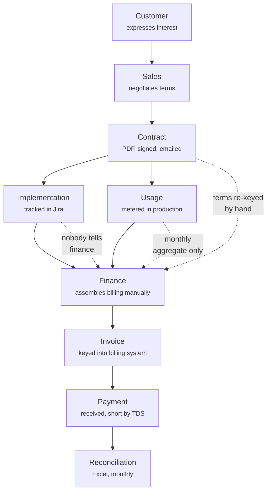
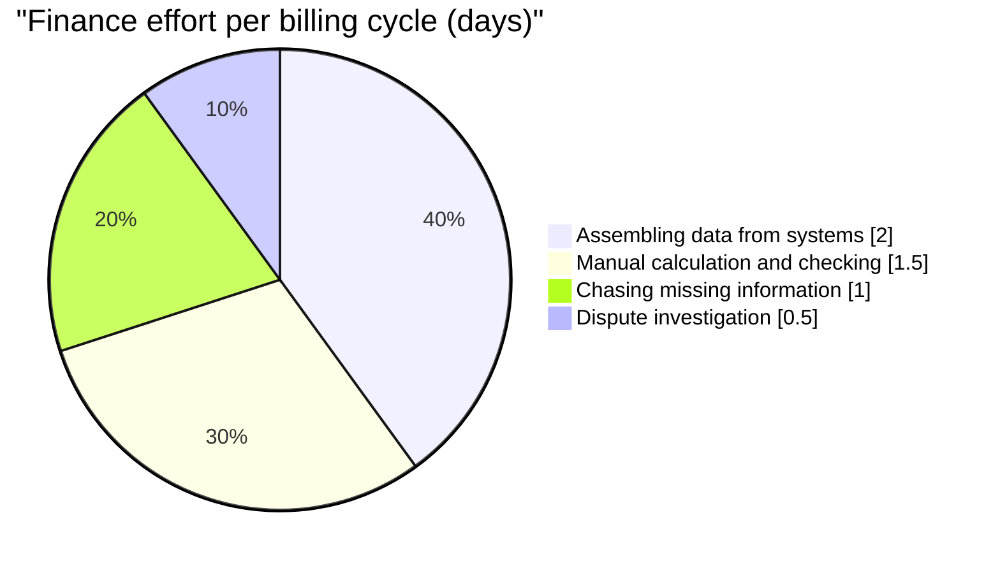
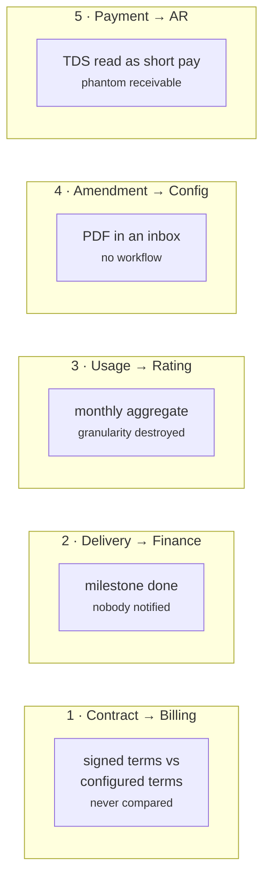

# 03 · Current State Journey
**How revenue operations actually work today**
Version 1.0 · 6 August 2026

Hero visual: [`visuals/journey-current-vs-future.html`](../visuals/journey-current-vs-future.html)

---

## 1. The journey, end to end

Following one contract — Orient Electric, CON-2026-114 — from first conversation to cash received.

The dotted lines are where the money leaks. Each is a handoff with no system behind it.

---

## 2. Stage by stage — what actually happens

### Stage 1 · Sales negotiates

Rep negotiates 500 users at ₹1,200, a tiered API deal, and a ₹40 lakh implementation. To close, they concede an 8% discount at 750 users if the customer expands within six months.

**System of record:** the CRM opportunity — which records *amount: ₹1.4 Cr* and nothing about how it decomposes.
**Where the real terms live:** a Word document, then a signed PDF, then an email thread.

> **The gap:** the CRM stores a number, not a pricing structure. Everything that makes the deal computable exists only in prose.

### Stage 2 · Contract executed

A PDF is signed and filed — SharePoint, or a folder, or an inbox. Finance receives it by email with "please set up billing."

An analyst reads the PDF and types the terms into the billing system by hand: 500 users, ₹1,200, monthly in advance, tiered usage with a 2M allowance, four milestones.

> **The gap:** this transcription is the origin point for errors that recur every month until someone notices. Nothing compares what was typed against what was signed. **Ever.**

### Stage 3 · Implementation runs

Delivery works in Jira. The UAT epic is marked Done on 14 July.

Arjun, the delivery manager, has just triggered a ₹12,00,000 billing event. He does not know this. Jira has no concept of billing eligibility, and nothing notifies finance.

> **The gap:** delivery evidence and billing eligibility are the same fact recorded in two systems that have never spoken. Whether it gets billed depends on whether someone remembers to mention it in a status call.

### Stage 4 · Usage accumulates

The platform meters 2.4M API calls in July. Engineering exports a monthly total to a CSV and mails it to finance around the 3rd.

> **The gap — and this one is fatal.** A *monthly aggregate* cannot be rated correctly across a mid-cycle amendment. Once the amendment lands on 16 July, there is no way to know how many calls fell either side of the boundary. The information required to bill correctly was destroyed at the moment of aggregation. *(Spike finding F3.)*

### Stage 5 · The amendment

On 16 July the customer expands to 750 users. Amendment A1 is signed. It arrives as a PDF attached to an email, cc'ing four people.

The analyst who owns Orient Electric is on leave. The email is read by someone who assumes finance has it.

> **The gap:** an amendment is a structural change to the pricing model, delivered as an attachment. There is no workflow, no acknowledgement, no verification that billing config was updated. **This is the single largest source of billing error in enterprise SaaS.**

### Stage 6 · Finance assembles the billing run

Month end. Meera opens a spreadsheet — the same one, extended each month for three years.

She pulls the user count from the CRM. The usage total from the emailed CSV. Milestone status from a Slack message. Contract terms from her memory of the PDF. She applies the amendment if she knows about it.

**Elapsed: 3–5 days of senior analyst time, every month.**

> **The gap:** the billing run exists in a spreadsheet on one person's laptop. It is not reproducible, not reviewable, and not auditable. When Meera is on leave, the close slips.

### Stage 7 · Invoice issued

Amounts are keyed into the billing system. An invoice is issued. The IRN must be filed with the GST portal within 30 days — tracked on a separate tab of the same spreadsheet.

If the amendment was missed, this invoice is now wrong, and it is **immutable**. Fixing it requires a credit note and a rebill — a conversation nobody wants to have with a customer.

### Stage 8 · Payment arrives short

The customer pays ₹9,00,000 against a ₹10,00,000 invoice. The ₹1,00,000 difference is TDS, which the customer deducted and deposited on Orient's behalf.

The billing system records `PARTIALLY_PAID`.

> **The gap:** this is not a shortfall, but the system cannot express that. The invoice sits in AR ageing forever. Collections chases money that was never owed. The TDS credit needs matching against Form 26AS — a separate manual exercise, often deferred past the point where it can be claimed. **Unclaimed TDS is permanent cash loss.**

### Stage 9 · Reconciliation

Quarterly, someone reconciles billed against contracted and finds discrepancies. Some are chased. Some are written off because the investigation costs more than the amount.

---

## 3. Where the time goes

Roughly 5 days per cycle, 60 days a year of senior finance time — almost none of which is judgement. It is retrieval and arithmetic.

---

## 4. The pain, categorised

| Category | Manifestation | Cost |
|---|---|---|
| **Manual work** | Terms re-keyed from PDF; billing assembled in Excel | 3–5 days/cycle |
| **Excel** | The billing run lives in a spreadsheet on one laptop | Not reproducible, not auditable, single point of failure |
| **Email** | Amendments and usage arrive as attachments | No acknowledgement, no workflow, silently missed |
| **Reconciliation** | Quarterly, manual, incomplete | Discrepancies found late or written off |
| **Delays** | Milestone → invoice depends on someone remembering | Weeks of avoidable DSO |
| **No visibility** | Nobody can decompose an invoice | Disputes take weeks; some conceded rather than investigated |
| **Compliance** | IRN clock and TDS credits tracked in spreadsheet tabs | Customer loses ITC; we lose unclaimed TDS |

---

## 5. The five blind spots

Places where information required to bill correctly exists in the organisation but reaches nobody who needs it.

Each of these becomes a system boundary in the future state, with an owner and an event.

---

## 6. Why this persists

It is worth being fair to the people in this workflow. This is not incompetence.

**Every individual system is doing its job correctly.** The CRM tracks opportunities well. Jira tracks work well. The billing system bills what it is told, accurately.

The failure is **at the joins**, and joins have no owner. There is no "Director of the Gap Between Jira and Billing." So the joins are held together by a spreadsheet and an experienced person's memory — which works, until that person takes leave, or the volume of contracts outgrows what one memory can hold.

**The honest framing:** we are not fixing broken systems. We are building the thing that has never existed — a system that owns the joins.

---

## 7. What this tells us about the product

| Observation | Requirement it produced |
|---|---|
| Terms are transcribed by hand | FR-2.1 — contract terms drive pricing directly |
| Usage arrives as monthly aggregate | FR-4.1 — reject monthly aggregates at the connector |
| Amendments arrive by email | FR-2.5, FR-3.1 — amendments are structural, create rating segments |
| Milestone completion notifies nobody | FR-4.3 — delivery evidence is a first-class input |
| Billing run is not reproducible | FR-3.2 — rating is a pure function |
| Nobody can explain an invoice | FR-3.7, NFR-2 — every amount carries a trace |
| TDS misread as short payment | Horizon 2 · detector L5 |
| IRN tracked in a spreadsheet | Horizon 2 · detector L4 |

---

## Related

- `04-future-state-journey.md` — the same journey, rebuilt
- `01-vision.md` §4 — pain points by persona
- `spikes/proration_spike.py` — proves stage 4's aggregation problem is fatal, not merely inconvenient
