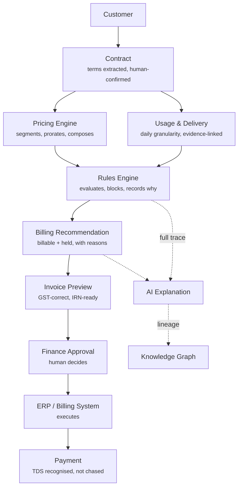
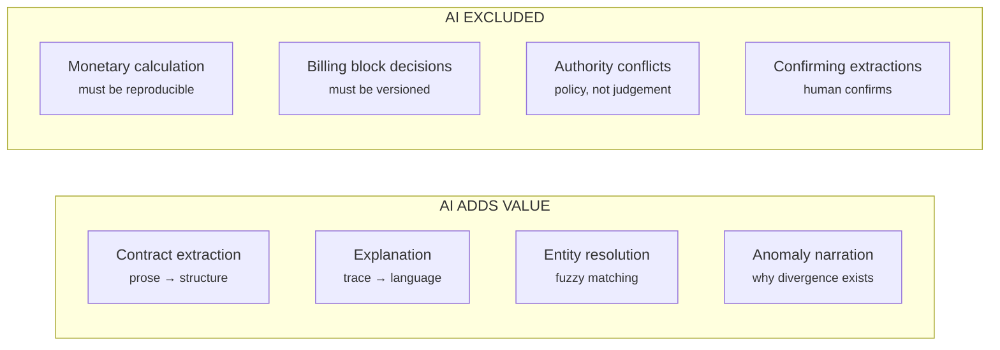

# 04 · Future State Journey
**Revenue operations with Revenue Nexus**
Version 1.0 · 6 August 2026

Hero visual: [`visuals/journey-current-vs-future.html`](../visuals/journey-current-vs-future.html)

---

## 1. The journey, rebuilt



The structural change: **contract terms flow directly into pricing.** No human retypes anything. The human's role moves from *assembling* the answer to *approving* it.

---

## 2. Stage by stage — what changes

### Stage 1 · Contract ingested

The signed PDF is ingested. The Contract Intelligence agent extracts terms — parties, lines, rates, tiers, milestones, payment terms, place of supply — and presents them as **`PROPOSED`**.

Meera reviews them side by side with the source PDF, each field linked to the clause it came from. She corrects two, confirms the rest.

> **What changed:** transcription is replaced by *review*. The error class doesn't shrink — it disappears, because nobody is typing. And the AI's output cannot affect a rupee until Meera confirms it (FR-2.4).

**Where AI helps:** reading unstructured prose into structure — genuinely hard, genuinely suited to a language model.
**Where AI stops:** it proposes. It never confirms.

### Stage 2 · Pricing computed

The Pricing Engine composes three strategies on one contract. It decomposes the billing period into rating segments at every amendment boundary and rates each independently, as a pure function.

> **What changed:** the calculation is reproducible. Run it again in three years against the same catalog and rule versions and you get the same number. That is what makes it auditable — and it is why rating has no I/O (FR-3.2).

**Where AI helps:** nowhere. **This is deliberate.** Arithmetic on money is deterministic code. An LLM computing a billable amount is unreproducible, unauditable, and indefensible to a statutory auditor.

### Stage 3 · Usage and delivery ingested

Usage arrives at daily granularity — a hard requirement, because monthly aggregates cannot be rated across a mid-cycle amendment (FR-4.1, spike finding F3).

Jira's UAT sign-off on 14 July becomes a `SatisfactionEvent` linked to a performance obligation, carrying its source link and timestamp. Crucially, it is modelled as *evidence*, not as *billing eligibility* — the contract's 30-day acceptance window decides that.

> **What changed:** Arjun still works in Jira. He is not asked to learn a new system. The connector does the work of noticing.

### Stage 4 · Rules evaluated

Six rules fire. Five pass. One blocks:

```
RULE-MILESTONE-007   Milestone billing requires acceptance window elapsed
  obligation      PO-114-04 (UAT sign-off, 30% of ₹40,00,000)
  evidence        Jira ORI-2291 · Done · 2026-07-14
  window          30 days from satisfaction → billable 2026-08-13
  today           2026-07-31
  DECISION        HOLD · ₹12,00,000
```

> **What changed:** the block is a *recorded decision with a reason and a date*, not a silence. In the current state, this line simply wouldn't appear and nobody would know it was missing.

**Where AI helps:** turning that trace into a sentence.
**Where AI stops:** it does not decide to block. A constrained DSL rule does, deterministically, reproducibly, versioned.

### Stage 5 · Billing recommendation

```
BILLING RECOMMENDATION · CON-2026-114 · July 2026

  Subscription — 2 rating segments               ₹7,17,677.42
    seg 1  01–15 Jul  500 users, 0% disc         ₹2,90,322.58
    seg 2  16–31 Jul  750 users, 8% disc         ₹4,27,354.84
  API usage — 2 rating segments                    ₹11,612.88
    seg 1  overage 193,548 calls @ ₹0.08          ₹11,612.88
    seg 2  under prorated allowance                     ₹0.00
  ─────────────────────────────────────────────────────────
  Taxable subtotal                               ₹7,29,290.30
  CGST @ 9%  ·  SGST @ 9%   (Karnataka intra-state) ₹1,31,272.26
  ─────────────────────────────────────────────────────────
  RECOMMENDED                                    ₹8,60,562.56

  HELD  Implementation milestone (UAT)          ₹12,00,000.00
        RULE-MILESTONE-007 · billable 13 Aug 2026
```

> Note the shape: **the held amount is larger than the billed amount.** That is realistic, and it makes the hold the most commercially interesting thing on the screen. A blocking rule with a good reason is a feature.

> Note also: naive whole-period rating would have produced ₹9,77,040 — an error of ₹1,16,477. *(Spike, F1–F2.)*

### Stage 6 · Explanation

Meera asks *"why is this ₹8,60,562.56?"* and gets a decomposition down to each rule firing, each linked to its source. Not generated prose — a **rendering of the decision trace**.

She asks *"what changed after the amendment?"* and sees before/after terms, the segment boundary A1 created, and the rupee impact attributed to each changed field.

> **Where AI helps:** the trace is a nested data structure; turning it into a paragraph a controller can read is a genuine language task.
> **Where AI stops:** every number in the answer came from the pricing engine. The AI never computes (FR-7.5).

### Stage 7 · Approval and execution

Meera approves. The recommendation goes to the billing system, which issues the invoice and files the IRN.

> **What changed:** her role moved from assembling to deciding. She still decides — we did not remove the human, we removed the retrieval and arithmetic that consumed her.

### Stage 8 · Payment

Payment arrives ₹1,00,000 short. The platform recognises TDS as a settlement component, not a shortfall. The invoice settles fully; the TDS credit enters its own lifecycle awaiting Form 26AS matching.

> *(Horizon 2 capability — modelled in the domain from day one so it isn't a retrofit.)*

---

## 3. Where AI helps, and where it must not

The most important table in this document.



| Where | Why AI | Why not rules |
|---|---|---|
| Contract extraction | Unstructured prose, infinite variation in phrasing | Regex over legal language fails on the second contract |
| Explanation | Trace → readable narrative is a language task | Templates produce robotic text that doesn't answer the actual question asked |
| Entity resolution | "Orient Electric" / "OEL" / "ORIENT ELEC LTD - BLR" | Rules get ~70%; AI meaningfully improves the rest — but rules run first |
| Anomaly narration | Requires reasoning over context | Rules detect divergence; they cannot hypothesise a cause |

| Where AI is excluded | Why |
|---|---|
| Computing any amount | Must be reproducible and defensible to an auditor. An LLM is neither. |
| Deciding to block billing | Must be versioned and replayable against historical rule versions |
| Resolving authority conflicts | A written precedence policy, not a runtime judgement |
| Confirming an extracted obligation | Extraction confidence must never substitute for human confirmation on money |

> **The principle, worth memorising:** *AI proposes, deterministic code disposes, and anything touching money is deterministic.* This is the same discipline as `AUTO_APPROVE_LIMIT` in the Zaggle work — a Python `if` cannot be talked around by a clever prompt.

---

## 4. Before and after

| Dimension | Current state | Future state |
|---|---|---|
| Billing run effort | 3–5 days | Under 1 day |
| Terms entry | Manual transcription | Extracted, human-confirmed |
| Amendment handling | Email + memory | Structural, creates rating segments |
| Mid-cycle amendment | Usually wrong or unnoticed | Segmented and prorated |
| Usage granularity | Monthly aggregate | Daily minimum, enforced |
| Milestone → billing | Someone remembers | Evidence-linked, rule-evaluated |
| Explaining an invoice | Days across 4 systems | One click, full lineage |
| Reproducibility | None | Any period, any time, same answer |
| Audit trail | A spreadsheet | Immutable, versioned, traversable |
| Human role | Assembling | Deciding |

---

## 5. What deliberately does not change

Honesty about limits is what makes the rest credible.

- **Arjun still works in Jira.** We do not ask delivery to adopt a finance tool.
- **The billing system still issues invoices.** We recommend; it executes.
- **Meera still approves every run.** We removed retrieval and arithmetic, not judgement.
- **The ERP is still the ledger.** We never post journal entries in v1.
- **Contracts are still negotiated by humans in documents.** We read them; we do not author them.

> A future state that changes everything is a future state nobody adopts. The measure of this design is how little of the customer's world it disturbs while still removing the work.

---

## Related

- `03-current-state-journey.md` — what we are replacing
- `02-prd.md` §6 — these stages as user stories with acceptance criteria
- `spikes/spike-output.txt` — where every figure on this page comes from
