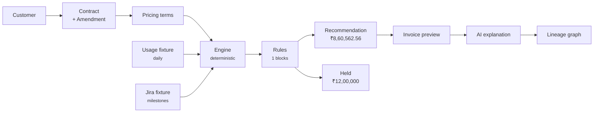
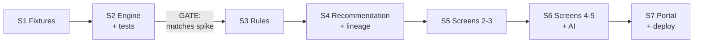

# Founder Demo — Scope Freeze
**Revenue Nexus AI** · Version 1.0 · 6 August 2026
**Status: awaiting approval. No implementation until approved.**

> This document **governs implementation**. Where it disagrees with `01-vision.md` or `02-prd.md`, this document wins. Those remain canonical for the broader product direction and are not being reduced — they describe the product; this describes the demonstration.

---

## 1. Revised Founder Demo scope

### Objective

One publicly accessible URL that communicates product thinking, enterprise architecture judgement, and execution ability in **approximately 10 minutes** — to a founder, on a phone, possibly weeks after the link is shared.

### The governing constraint

> **Every element must earn its place in a 10-minute story. Anything that does not strengthen the narrative is cut, regardless of how interesting it is to build.**

### The second constraint, less obvious but equally binding

> **The link must work cold, months later, with zero maintenance.**

This is not a scale problem — it is a *rot* problem, and it drives real architectural decisions:

| Risk | Decision |
|---|---|
| Free-tier Postgres sleeps or expires after inactivity | **No hosted database.** Fixtures are committed JSON in the repository. |
| API key expires, rate-limits, or costs money | **AI explanations pre-computed and committed.** Live generation only when a key is present. |
| Serverless cold start on an unfamiliar platform | **Vercel + Next.js.** Static-first rendering; nothing that needs to wake up. |
| Two deploys drifting out of sync | **One application.** Portal and demo are the same app. |

A demo that fails silently while someone important is looking at it is worse than no demo. Durability is a feature here, not an afterthought.

### What we are demonstrating — four claims, and nothing else

| # | Claim | Proven by |
|---|---|---|
| 1 | I can find the real problem, not the obvious one | Executive Overview: the seam nobody owns |
| 2 | I understand enterprise revenue mechanics deeply | The mid-cycle amendment priced correctly, to the paisa |
| 3 | I know where AI belongs and where it must not go | Explanation renders a deterministic trace; AI never computes |
| 4 | I can execute, not just diagram | A working link, real arithmetic, verifiable lineage |

**Claim 2 is the differentiator.** Anyone can build a dashboard. Very few can explain why segmented rating produces ₹8,60,562.56 while naive rating produces ₹9,77,040 — and show the working.

### The one vertical slice

**Orient Electric Ltd · Contract CON-2026-114 · July 2026 billing period**

One customer. One contract. Three pricing models composed. One mid-cycle amendment. One held milestone.



---

## 2. Five-screen sitemap

**Simplification worth noting:** the requested "Executive Overview" screen and the requested "executive portal" are the same artifact. Making them one thing removes a redundant page and gives a single shareable URL that *is* the demo's opening.

```
https://revenue-nexus.vercel.app
│
├── /                        SCREEN 1 · Executive Overview + Portal
│                            problem · current-vs-future · architecture ·
│                            key result · links to docs and GitHub
│                            → "Walk the demo" CTA
│
├── /demo/contract           SCREEN 2 · Customer & Contract
│                            Orient Electric · 3 pricing components ·
│                            amendment A1 · contract document viewer
│
├── /demo/billing            SCREEN 3 · Billing Recommendation  ★ HERO
│                            segments · subscription · usage · held
│                            milestone · GST · total · full trace
│
├── /demo/explain            SCREEN 4 · Explain the Decision
│                            three questions, answered from the trace
│
├── /demo/lineage            SCREEN 5 · Knowledge Graph / Lineage
│                            customer → contract → amendment → product →
│                            rule → evidence → recommendation
│
└── /docs                    Document index → canonical Markdown + GitHub
```

Persistent bottom navigation across `/demo/*` so the story can be walked forward or jumped into at any point. Every screen is deep-linkable — a founder who opens the link on a phone lands somewhere coherent regardless of which link was shared.

---

## 3. Exact demo journey

Timed, with what is on screen and what is said. Ten minutes.

### 0:00 – 1:30 · Screen 1 — Executive Overview

**On screen:** the problem statement, the current-vs-future visual, one headline number.

> "A SaaS company sells subscriptions, usage, and implementation projects — often on one contract. Sales sees the contract. Delivery sees milestones. Engineering sees usage. Finance sees invoices. Nobody can answer *why is this invoice this amount* without three days across four systems.
>
> Clari and the revenue orchestration category own everything before the signature. Chargebee and Zuora own everything after an invoice exists. Nobody owns the middle — which is where the pricing logic actually lives, scattered across a PDF, a spreadsheet, a config screen, and one analyst's memory.
>
> That's what this owns."

**Click:** Walk the demo →

### 1:30 – 3:00 · Screen 2 — Customer & Contract

**On screen:** Orient Electric, contract CON-2026-114, three pricing components, amendment A1 highlighted.

> "One customer, one contract, three pricing models at once — subscription per user, tiered API usage, and milestone billing on a ₹40 lakh implementation. That composition is the enterprise reality and it's what makes this hard.
>
> Then on the 16th of July, mid-cycle, they expand from 500 to 750 users with an 8% discount, and the API allowance goes from 2 million to 3 million calls.
>
> Every billing system I've looked at gets this wrong."

**Click:** Compute the July billing decision →

### 3:00 – 6:00 · Screen 3 — Billing Recommendation *(the hero — three minutes here)*

**On screen:** the full recommendation with expandable trace.

> "₹8,60,562.56 recommended.
>
> The important part is *why*. The billing period isn't rated as one unit — it's split into two rating segments at the amendment boundary, and each is rated independently. First fifteen days at 500 users, no discount. Last sixteen at 750 with 8% off.
>
> The usage allowance is prorated too. That matters: the naive approach applies the new 3-million allowance to the whole month, sees no overage, and bills nothing for usage. Correct segmentation finds 193,548 overage calls in the first segment.
>
> If you rate this period as one unit you get ₹9,77,040. That's a ₹1,16,477 error — thirteen and a half percent — on one contract for one month. And it's two errors in opposite directions partially hiding each other, which is why nobody catches it by eye.
>
> Then there's this." *(scroll to held line)*
>
> "₹12,00,000 held. The UAT milestone was signed off in Jira on the 14th, but the contract specifies a 30-day acceptance window. It becomes billable on the 13th of August. That's not an error — it's a decision, with a reason and a date. In the current state this line simply wouldn't appear and nobody would know it was missing.
>
> Note the shape: the held amount is larger than the billed amount."

**Click:** Explain this →

### 6:00 – 8:00 · Screen 4 — Explain the Decision

**On screen:** three questions, answered.

> "Three questions a controller actually asks.
>
> *Why is this the amount?* — decomposed by segment and rule, every element linked to its source.
>
> *Why is the milestone held?* — the rule, the evidence it evaluated, and the date it clears.
>
> *What changed after the amendment?* — before and after terms, the segment boundary it created, and the rupee impact of each changed field.
>
> Here's the part I'd want a CTO to notice: **the AI didn't calculate any of these numbers.** The pricing engine is a pure function — no database reads, no clock, no I/O. Same inputs, same output, forever. The AI reads the calculation trace and turns it into language.
>
> That's deliberate. An LLM computing a billable amount is unreproducible and indefensible to an auditor. AI proposes, deterministic code disposes, and anything touching money is deterministic."

**Click:** Show the lineage →

### 8:00 – 9:30 · Screen 5 — Knowledge Graph / Lineage

**On screen:** the compact lineage graph, one path highlighted.

> "Every rupee traces back. Customer, contract, amendment, product, pricing rule, the usage and milestone evidence, the recommendation.
>
> This is the one place the graph earns its cost. *How much did we bill* is a SQL query. *Why, and through what chain* is a path traversal — and it's what an auditor actually asks for. Postgres stays the transactional store; the graph is a derived read model. Nothing financial depends on it."

### 9:30 – 10:00 · Close

> "Fifteen design documents, one throwaway spike that found a rewrite-class flaw on day one, and a working slice. The architecture document shows where this splits into services when it needs to — deliberately not built that way now, because fifteen microservices built by one person demonstrates reading about microservices, not running them.
>
> Documentation and code are linked from the front page."

**Back to:** `/` → docs and GitHub.

---

## 4. In-scope / mocked / roadmap

### Column A — Actually implemented and working

| Item | Detail | Traces to |
|---|---|---|
| Pricing engine — segmentation | Period split at amendment boundaries | FR-3.1 |
| Pricing engine — subscription | Per-unit with discount, prorated by segment | FR-3.3 |
| Pricing engine — tiered usage | Explicit tier interpretation, prorated allowance | FR-3.4, FR-1.3 |
| Pricing engine — milestone | Percentage-of-value, acceptance window | FR-2.2 |
| Pricing engine — purity | No I/O, decimal arithmetic, deterministic | FR-3.2, FR-3.8 |
| Calculation trace | Complete, structured, on every amount | FR-3.7, NFR-2 |
| Rules evaluation | ~6 rules as data, decision tree output | FR-5.1, FR-5.3 |
| Billing hold with reason | The UAT milestone case | FR-5.4, FR-6.1 |
| GST computation | CGST/SGST intra-state, separate rounding | FR-6.2 |
| Invoice preview | Line-by-line, GST-decomposed | FR-6.2 |
| AI explanation | Three questions, rendered from trace | FR-7.1–7.3 |
| Lineage graph | Compact, traversable, ~15 nodes | FR-8.2 |
| Five screens | Responsive, deep-linkable | — |
| Golden test suite | Engine output must match spike to the paisa | NFR-10 |

### Column B — Visually represented or mocked only

| Item | How it appears | Why not built |
|---|---|---|
| HubSpot customer data | JSON fixture behind a typed connector interface | Real OAuth adds no story |
| Jira milestone data | JSON fixture behind a typed connector interface | Same |
| Daily usage data | 31-day JSON fixture | Same |
| Contract document | Realistic readable contract + structured JSON | Extraction is a separate story |
| Connector architecture | Typed interfaces with fixture adapters, no network | Shows extensibility without integration cost |
| PostgreSQL | Schema shown in architecture doc; fixtures are the store | A hosted DB is a rot risk (§1) |
| Event bus | Shown in architecture diagram only | Zero narrative value at one-contract scale |
| Future service boundaries | Marked on the architecture diagram | Building them would weaken the story, not strengthen it |
| Contract extraction (AI) | Screen 2 shows terms as confirmed; extraction narrated, not run | Adds 2 minutes and a failure mode to a 10-minute demo |
| Authentication | Not present; demo is public | Login is friction on a shared link |

### Column C — Future roadmap, explicitly deferred

| Item | Horizon |
|---|---|
| One-time, wallet, per-API, hybrid pricing strategies | H1 full product |
| Rule authoring UI | H1 full product |
| Multi-tenancy, multi-currency, multi-GSTIN allocation | H2 |
| Real integrations (HubSpot, Jira, Tally, GST IRP) | H2 |
| Leakage detection — the five detectors | H2 |
| Renewals, revenue intelligence, forecasting | H2 |
| Ind AS 115 revenue schedules and GL posting | H2 |
| TDS reconciliation against Form 26AS | H2 |
| Write-back: raise invoice, file IRN, post journal | H3 |
| Deployed microservices | When there is an organisational reason |

### What we are explicitly rejecting, and why

Aggressive reduction means naming the tempting things being cut.

| Cut | Why it's tempting | Why it goes |
|---|---|---|
| A second customer or contract | Shows the engine generalises | Doubles fixture work, adds zero minutes of story |
| Live contract PDF extraction | Genuinely impressive AI | Two minutes and a live failure mode; the *discipline* around it is the point, and that can be narrated |
| Rule authoring UI | Shows configurability | Nobody authors a rule in a 10-minute demo |
| Dark mode | Polish | Zero narrative value |
| Real Postgres | Matches the documented architecture | The rot risk outweighs the fidelity gain |
| Event bus implementation | Architectural completeness | Invisible at one-contract scale |
| Charts and analytics | Looks like a product | Distracts from the one number that matters |
| User accounts | Feels finished | Friction on a shared link |
| Mobile-first redesign | Founders open links on phones | Responsive is enough; the hero screen is a table |

---

## 5. Minimal implementation plan

### Stack

| Layer | Choice | Rationale |
|---|---|---|
| Framework | Next.js (App Router), TypeScript | One app, one deploy, static-first |
| Hosting | Vercel free tier | No cold-start DB, no maintenance |
| Engine | TypeScript module, pure functions | Ported from `spikes/proration_spike.py` |
| Money | `decimal.js` | Never floating point (FR-3.8) |
| Store | Committed JSON fixtures | Nothing that can expire |
| Graph | Client-side SVG from the trace | ~15 nodes; a graph database would be theatre |
| AI | Anthropic API via server route, pre-computed fallback | Demo never depends on it |
| Styling | Tailwind, design language from existing visuals | Already established |

### Module structure

```
revenue-nexus-demo/
├── app/
│   ├── page.tsx                    SCREEN 1 · portal + exec overview
│   ├── demo/
│   │   ├── layout.tsx              persistent demo navigation
│   │   ├── contract/page.tsx       SCREEN 2
│   │   ├── billing/page.tsx        SCREEN 3 · hero
│   │   ├── explain/page.tsx        SCREEN 4
│   │   └── lineage/page.tsx        SCREEN 5
│   ├── docs/page.tsx               document index
│   └── api/explain/route.ts        live AI (optional, guarded)
│
├── lib/
│   ├── engine/                     PURE. no I/O. fully tested.
│   │   ├── segment.ts              period → rating segments
│   │   ├── subscription.ts         per-unit, prorated
│   │   ├── usage.ts                tiered, prorated allowance
│   │   ├── milestone.ts            percentage, acceptance window
│   │   ├── tax.ts                  GST, separate heads
│   │   ├── compose.ts              orchestrates, emits trace
│   │   └── types.ts                Terms, Segment, Trace, Decision
│   ├── rules/
│   │   ├── catalog.ts              6 rules as data, versioned
│   │   └── evaluate.ts             → decision tree
│   ├── lineage/build.ts            trace → graph nodes and edges
│   └── connectors/                 typed interfaces + fixture adapters
│       ├── types.ts                CrmConnector, IssueConnector, UsageConnector
│       └── fixtures.ts             the only implementation in this build
│
├── fixtures/
│   ├── customer.hubspot.json
│   ├── contract.CON-2026-114.json
│   ├── contract.CON-2026-114.md    human-readable contract
│   ├── jira.milestones.json
│   ├── usage.daily.2026-07.json    31 days
│   └── explanations.json           pre-computed, human-reviewed
│
├── components/                     TraceTable, HeldLine, GraphCanvas, …
└── tests/
    └── engine.spec.ts              golden fixtures from the spike
```

### The one hard gate

> **`tests/engine.spec.ts` must reproduce the spike's figures exactly — ₹7,17,677.42 subscription, ₹11,612.88 usage, ₹7,29,290.30 subtotal, ₹8,60,562.56 total — before any UI work begins.**

If the TypeScript port and the Python spike disagree by one paisa, one of them is wrong, and finding out during UI work is expensive. The engine is finished when the tests pass, and not before.

---

## 6. Estimated sequence of work

Seven stages. Effort is relative, not calendar — I don't know your availability.

| # | Stage | Output | Effort | Gate |
|---|---|---|---|---|
| S1 | **Fixtures & contract** | All JSON fixtures + readable contract document. Believable names, GSTINs, dates, Jira keys. | S | Data reads as real, not placeholder |
| S2 | **Engine port + tests** | `lib/engine/*` with golden tests | **L** | **Matches spike to the paisa** |
| S3 | **Rules + decision tree** | 6 rules as data, evaluation, hold with reason | M | UAT milestone holds with correct clearing date |
| S4 | **Recommendation + lineage** | Assembly, invoice preview, trace → graph | M | Full trace renders; every node has a source |
| S5 | **Screens 2 & 3** | Contract view + billing hero | **L** | Hero screen tells the story with no narration |
| S6 | **Screens 4 & 5 + AI** | Explain + lineage; pre-compute explanations | M | Three questions answered, verifiably from trace |
| S7 | **Screen 1 + deploy** | Portal, docs index, Vercel deploy, polish pass | M | Link works cold on a phone |



**Front-loaded deliberately.** S2 is the largest stage and the one nobody sees. That is correct: if the arithmetic is wrong, everything downstream is decoration. The demo's entire credibility rests on ₹8,60,562.56 being defensible under questioning.

**Risk register**

| Risk | Mitigation |
|---|---|
| TS/Python decimal divergence | Golden tests at S2; port the rounding policy explicitly, not by feel |
| Hero screen too dense to read in 3 minutes | Progressive disclosure — trace collapsed by default, expands on click |
| Fixtures look synthetic | S1 is a real stage, not an afterthought. Realistic GSTINs, plausible Jira keys, believable dates. |
| AI explanation sounds generic | Pre-compute, then *edit by hand*. Committed output is reviewed output. |
| Scope creep during S5–S7 | This document. Anything not in Column A requires re-approval. |

---

## Approval

Implementation begins on your approval. If you want changes, the cheapest place to make them is here.

**Open items you may want to decide now:**

1. Domain — `revenue-nexus.vercel.app` or a custom domain?
2. Should the GitHub repository be public from S1, or published at S7?
3. Is `Orient Electric Ltd` the right fictional customer, or would you prefer a name with no real-world counterpart? *(There is a real Orient Electric; a wholly invented name may be safer for a public demo.)*
